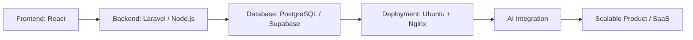

<div align="center">

# Hi, I'm Muhammad Sidiq Firdaus 👋

### Informatics Student • Fullstack Web Developer • AI & EdTech Enthusiast

I build web-based information systems, dashboards, public service platforms, and AI-assisted learning ideas that solve real problems for students, communities, and organizations.

[](https://github.com/Sidiq-coder)
[](https://github.com/Sidiq-coder)
[](https://www.linkedin.com/in/muhammad-sidiq-firdaus-b23123274)
[](mailto:msidiqfirdauss@gmail.com)

</div>

---

## 🚀 About Me

- 🎓 I am an **Informatics student** with a strong interest in **software engineering, fullstack web development, AI, and educational technology**.
- 💻 I mainly work with **React.js, Vite, Tailwind CSS, Laravel, PostgreSQL, Supabase, and Python**.
- 🧠 I am currently exploring **AI-powered education platforms**, **adaptive learning systems**, **student diagnostics**, and **machine learning projects**.
- 🏗️ I enjoy building end-to-end systems: from UI design, API integration, database design, authentication, deployment, to documentation.
- 🎯 My long-term goal is to become a **Software Engineer / System Developer** who can build useful, scalable, and impactful products.

---

## 🧭 Current Focus

```txt
Frontend Engineering      React.js, Vite, Tailwind CSS, Zustand, React Query
Backend Development       Laravel, Node.js, Express.js, REST API, API Security
Database & Data Design    PostgreSQL, MySQL, Supabase, ERD, relational schema
AI & Machine Learning     NLP, image classification, LoRA/PEFT, model training
DevOps & Deployment       Ubuntu Server, Nginx, SSL, Git, GitHub, Docker basics
Product Development       EdTech, SaaS ideas, dashboards, automation, public systems
```

---

## 🛠️ Tech Stack

### Languages


### Frontend


### Backend, Database & Cloud


### AI, Data & Tools


---

## 📌 Highlighted Projects

### 🏙️ Kelurahan Sawah Lama Website

A dynamic public service website and admin dashboard for Kelurahan Sawah Lama.

**Key features:**

- Dynamic landing page content powered by Supabase.
- Admin dashboard for managing hero section, services, organization structure, gallery, news, statistics, contact, and profile content.
- Image upload integration using Cloudflare R2.
- Data fetching and cache management using React Query.
- Responsive public interface with Swiper and Framer Motion.

**Tech stack:** React 19, Vite, Tailwind CSS, Supabase, React Query, React Router, Swiper, Framer Motion, Cloudflare R2.

🔗 Repository: [Sidiq-coder/Sawah-Lama](https://github.com/Sidiq-coder/Sawah-Lama)

---

### 🏥 SIKAM — Sistem Klinik Advokasi Mahasiswa

A web-based student advocacy clinic system designed to help students submit aspirations, report problems, and apply for UKT appeals through an online documented system.

**Focus areas:**

- Student report and aspiration submission.
- Online UKT appeal request flow.
- Structured and documented case management concept.
- Frontend implementation with form handling, routing, validation, and state management.

**Tech stack:** React, Vite, Tailwind CSS, Axios, React Hook Form, Zod, React Router, Zustand.

🔗 Repository: [Sidiq-coder/SiKAM-FrontEnd](https://github.com/Sidiq-coder/SiKAM-FrontEnd)

---

### 🧠 Edutive AI / Adaptive Learning System

An AI-powered education concept focused on diagnostic learning, pre-test/post-test analysis, student learning gaps, teacher insight dashboards, and personalized learning recommendations.

**Main ideas:**

- Chapter-based pre-test and post-test.
- Student ability mapping.
- Learning gap detection.
- AI-assisted question generation and explanation.
- Teacher dashboard for class-level insights and grouping recommendations.

**Goal:** Build an education platform that helps teachers understand student needs and supports more adaptive learning.

---

### 🗂️ AduanKonten System

A web-based complaint/reporting system built as a practical fullstack project, focusing on public report submission, ticket tracking, admin management, status updates, and deployment.

**Core stack:** React.js, Laravel REST API, PostgreSQL, Sanctum, Nginx, Ubuntu Server.

---

### 🧪 Machine Learning & AI Experiments

Several learning and research experiments involving image classification, NLP classification, transfer learning, ensemble methods, PEFT/LoRA, and model evaluation.

**Topics explored:**

- MobileNetV2 vs AdaBoost for waste classification.
- Indonesian text classification.
- Cognitive distortion classification using PEFT LoRA.
- Dataset preparation, preprocessing, training, and evaluation metrics.

---

## 🧩 Other Project Areas

| Area | What I Build |
|---|---|
| 🌐 Web Applications | Landing pages, dashboards, admin panels, CRUD systems, public portals, and fullstack products. |
| 🤖 AI-Powered Tools | Question generators, learning assistants, classification systems, recommendation systems, and automation tools. |
| 📊 Data Systems | Dataset preparation, evaluation reports, insight dashboards, and analytics features. |
| 🏫 Campus & Community Systems | Systems for students, organizations, public services, education, and operational workflows. |

---

## 📈 GitHub Stats

<div align="center">


<br />


</div>

---

## 🗺️ Learning Roadmap



---

## 🎯 2026 Goals

- Build stronger and cleaner fullstack portfolio projects.
- Improve backend architecture, API design, authentication, and system security.
- Develop EdTech products and AI-powered learning systems.
- Learn better deployment, cloud, Docker, CI/CD, and production readiness.
- Create useful open-source repositories and better technical documentation.
- Grow personal branding through GitHub, LinkedIn, and project-based content.

---

## 🤝 Let's Connect

<div align="center">

[](https://www.linkedin.com/in/muhammad-sidiq-firdaus-b23123274)
[](mailto:msidiqfirdauss@gmail.com)
[](https://github.com/Sidiq-coder)
[](https://instagram.com/msidiqfirdaus)

</div>

---

<div align="center">

### "Build, learn, improve, and turn ideas into useful systems."

⭐ Thanks for visiting my profile!

</div>
