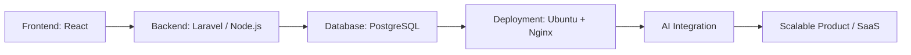

<div align="center">

# Hi, I'm Muhammad Sidiq Firdaus 👋

### Informatics Student • Full-Stack Web Developer • AI & Data Enthusiast

I enjoy building practical digital products, learning systems, dashboards, automation tools, and AI-powered applications that solve real problems.

[](https://github.com/Sidiq-coder)
[](https://github.com/Sidiq-coder)
[](mailto:msidiqfirdauss@gmail.com)

</div>

---

## 🚀 About Me

- 🎓 Informatics student with strong interest in **software engineering, web systems, AI, and data-driven applications**.
- 💻 I mostly work with **React.js**, **Laravel**, **Node.js**, **PostgreSQL**, and **Python**.
- 🧠 Currently exploring **AI-powered education platforms**, **adaptive learning systems**, and **machine learning projects**.
- 🏗️ I like building end-to-end systems: from UI design, API development, database design, deployment, to documentation.
- 🎯 Long-term goal: become a **Software Engineer / System Developer** and build impactful products for education, communities, and organizations.

---

## 🧩 Current Focus

```txt
Frontend Engineering     React.js, Vite, Tailwind CSS, Material UI, shadcn/ui
Backend Development      Laravel, Node.js, Express.js, REST API
Database & Data Design   PostgreSQL, MySQL, ERD, relational schema design
AI & Machine Learning    NLP, image classification, LoRA/PEFT, model training
DevOps & Deployment      Ubuntu Server, Nginx, SSL, Git, GitHub, Docker basics
Product Development      SaaS ideas, EdTech platforms, dashboards, automation
```

---

## 🛠️ Tech Stack

### Languages


### Frontend


### Backend & Database


### AI, Data & Tools


---

## 📌 Featured Project Areas

### 🧠 Edutive AI / Adaptive Learning System
An AI-powered education concept focused on diagnostic learning, pre-test/post-test analysis, student learning gaps, teacher insight dashboards, and personalized learning recommendations.

**Main ideas:**
- Student ability mapping
- Chapter-based pre-test and post-test
- Learning gap detection
- Teacher dashboard and class grouping
- AI-assisted question generation and explanations

### 📝 CBT & Quiz Platform
A session-based examination platform with participant registration, theme selection, exam module, multiple-choice/essay questions, project submission, admin dashboard, monitoring, and review system.

**Core stack:** React, Vite, Material UI, Tailwind CSS, Node.js, Express.js, PostgreSQL.

### 🗂️ AduanKonten System
A web-based public complaint/reporting system built with React.js frontend and Laravel REST API backend, including public submission, ticket tracking, admin management, status updates, and deployment on Ubuntu Server with Nginx.

**Core stack:** React.js, Laravel, PostgreSQL, Sanctum, Nginx, Ubuntu Server.

### 🧪 Machine Learning Experiments
Several experiments involving image classification, NLP classification, transfer learning, ensemble methods, PEFT/LoRA, and model evaluation.

**Topics:**
- MobileNetV2 vs AdaBoost for waste classification
- Indonesian text classification
- Cognitive distortion classification using PEFT LoRA
- Dataset preparation and evaluation metrics

---

## 🧭 What I Like to Build

<table>
  <tr>
    <td width="50%">
      <h3>🌐 Web Applications</h3>
      <p>Dashboards, information systems, admin panels, public portals, CRUD systems, and full-stack products.</p>
    </td>
    <td width="50%">
      <h3>🤖 AI-Powered Tools</h3>
      <p>Question generators, learning assistants, classification systems, recommendation systems, and automation tools.</p>
    </td>
  </tr>
  <tr>
    <td width="50%">
      <h3>📊 Data Systems</h3>
      <p>Data pipelines, evaluation reports, insight dashboards, dataset preparation, and analytics features.</p>
    </td>
    <td width="50%">
      <h3>🛠️ Real-World Systems</h3>
      <p>Systems for campus, organizations, education, community services, and operational workflows.</p>
    </td>
  </tr>
</table>

---

## 📈 GitHub Stats

<div align="center">


<br />


</div>

---

## 🗺️ Learning Roadmap



---

## 🎯 2026 Goals

- Build stronger full-stack portfolio projects.
- Improve backend architecture, API design, and system security.
- Develop EdTech products and AI-powered learning systems.
- Learn better deployment, cloud, Docker, and production readiness.
- Create useful open-source repositories and technical documentation.
- Grow personal branding through GitHub, LinkedIn, Instagram, and YouTube.

---

## 🤝 Let's Connect

<div align="center">

[](mailto:msidiqfirdauss@gmail.com)
[](https://github.com/Sidiq-coder)
[](https://instagram.com/msidiqfirdaus)

</div>

---

<div align="center">

### "Build, learn, improve, and turn ideas into useful systems."

⭐ Thanks for visiting my profile!

</div>
